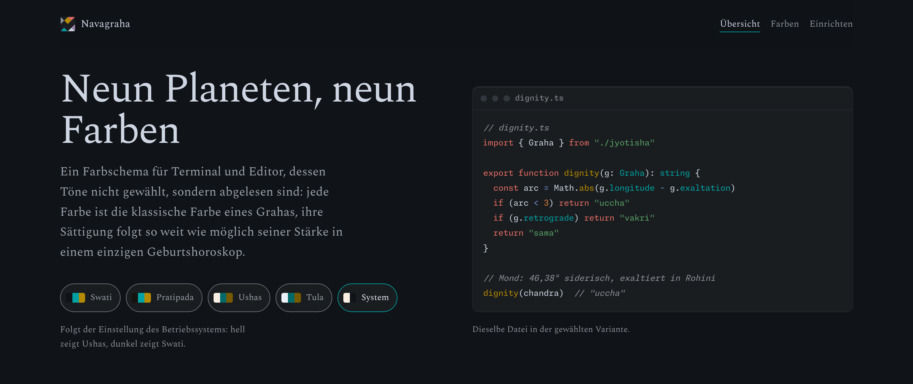

# Navagraha

<picture>
  <source media="(prefers-color-scheme: light)" srcset="docs/screenshot-light.png">
  
</picture>

Ein Farbschema für Terminal und Editor. Seine neun Akzentfarben sind nicht
ausgesucht, sondern aus einem Geburtshoroskop abgelesen: Jede ist die
klassische Farbe eines der neun Grahas der indischen Astrologie.

Es gibt vier Varianten, zwei dunkle (Swati, Pratipada) und zwei helle
(Ushas, Tula). Alle Textfarben erreichen auf jeder Fläche mindestens 4,5:1
Kontrast.

**[Zur Seite](https://daehnie.github.io/navagraha/)** – mit allen Farben,
ihrer Herleitung und einer Vorschau in jeder Variante.

## Für diese Programme

- [VS Code](themes/vscode/navagraha/)
- [CotEditor](themes/coteditor/)
- [iTerm2](themes/iterm2/)
- [Tabby](themes/tabby/)
- [Vim und Neovim](themes/vim/) – nimmt die Farben vom Terminal
- [bat](themes/bat/) – ebenso

## Lizenz

MIT, siehe `LICENSE`. Die Schriften der Seite, Spectral und Monaspace Neon,
stehen unter der SIL Open Font License 1.1.

---

## English

A colour scheme for terminal and editor whose nine accent colours are read
from a birth chart rather than picked: each is the classical colour of one
of the nine grahas of Indian astrology. Four variants, two dark and two
light. **[Visit the site](https://daehnie.github.io/navagraha/en/)** or
pick your program above.
