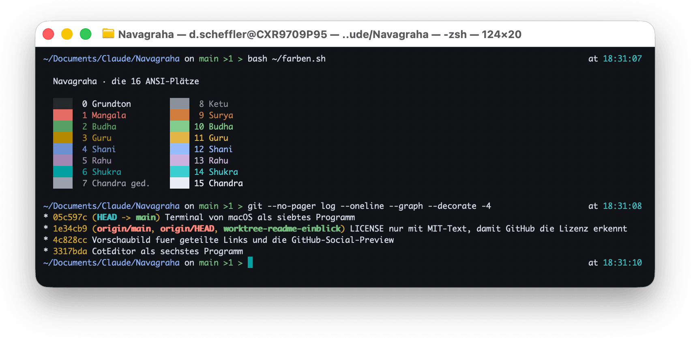
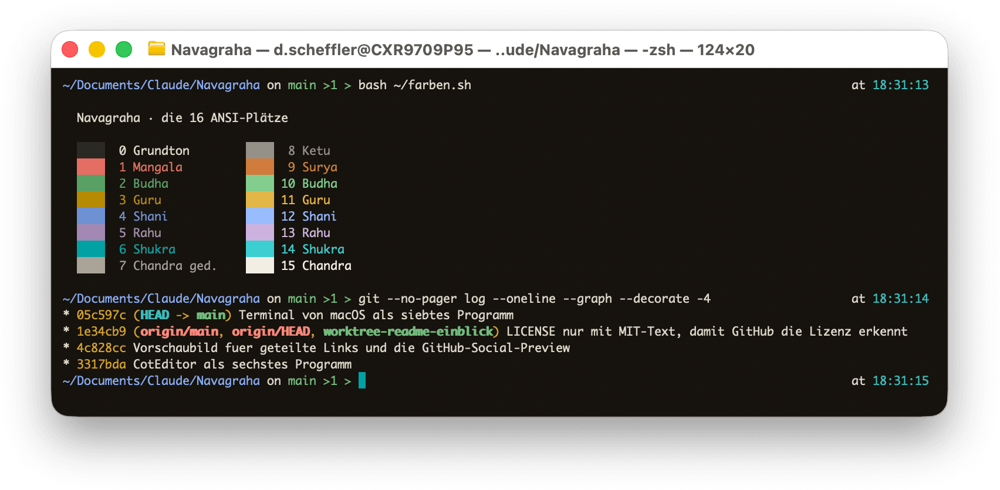
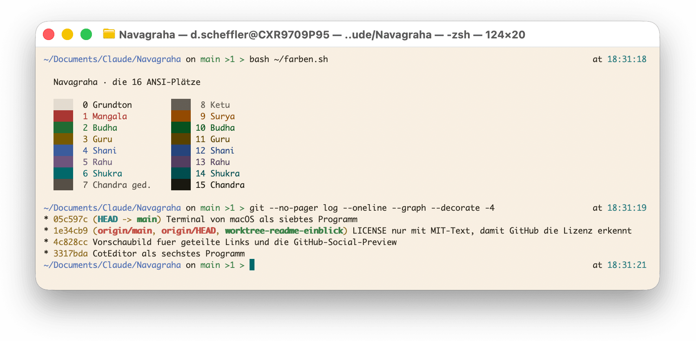
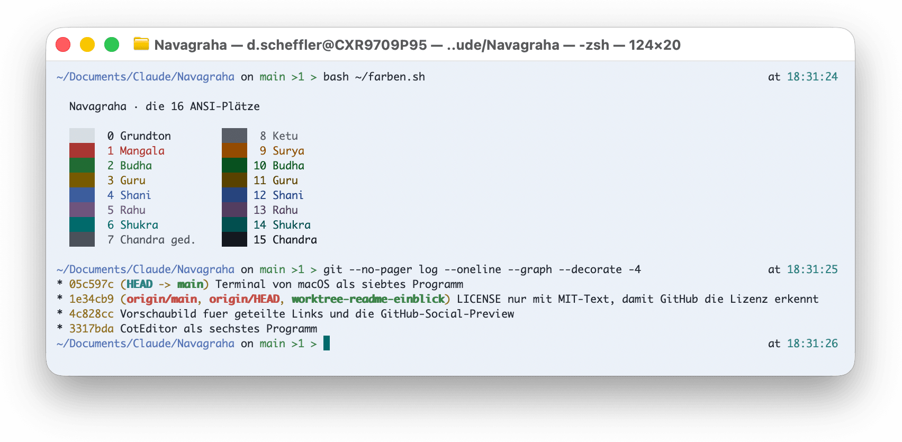

  

<h2 align="center">Navagraha für das Terminal von macOS</h2>

Neun Planeten, neun Farben — ein Farbschema, abgelesen aus einem Geburtshoroskop.

  <a href="https://daehnie.github.io/navagraha/">Zur Seite</a> · <a href="#english">English</a>

Vier Profile für Terminal, zwei dunkle (Swati, Pratipada) und zwei helle
(Ushas, Tula).

## Einbauen

1. Die vier `.terminal`-Dateien doppelklicken. Terminal öffnet je ein Fenster
   in der Variante und nimmt das Profil in die Einstellungen auf. Die Fenster
   können danach zu.
2. **Terminal → Einstellungen… → Profile** öffnen, eine Variante wählen und
   unter der Liste **Standard** klicken. Neue Fenster starten damit.

## Gut zu wissen

Terminal wechselt nicht mit der Systemdarstellung: das gewählte Profil gilt
für helle und dunkle Umgebung gleichermaßen. Wer beides will, wählt von Hand
oder legt sich zwei Fenstergruppen an.

Die Profile bringen nur Farben mit. Schriftart, Fenstergröße und Verhalten
bleiben so, wie Terminal sie voreinstellt; die Schrift steht im selben
Bereich unter **Text**.

Terminal kennt keine eigene Farbe für markierten Text — was markiert ist,
behält seine Farbe. Die Auswahlfläche liegt deshalb auf der obersten
Grundfläche der Palette, gegen die jede Farbe auf 4,5:1 gelöst ist.

## Galerie

**Navagraha Swati** · dunkel

**Navagraha Pratipada** · dunkel

**Navagraha Ushas** · hell

**Navagraha Tula** · hell

---

## English

Nine planets, nine colours — a colour scheme read from a birth chart.
[Visit the site](https://daehnie.github.io/navagraha/en/).

1. Double-click the four `.terminal` files. Terminal opens a window in each
   variant and adds the profile to its settings; those windows can be closed.
2. Open **Terminal → Settings… → Profiles**, pick a variant and click
   **Default** below the list. New windows start with it.

Terminal does not follow the system appearance: the chosen profile applies in
both light and dark surroundings, so switching is done by hand.

The profiles carry colours only — font, window size and behaviour stay at
Terminal's own defaults; the font sits in the same pane under **Text**.

Terminal has no separate colour for selected text, so a selection keeps the
colour it had. The selection sits on the topmost ground of the palette, the
one every colour is solved against at 4.5:1.
