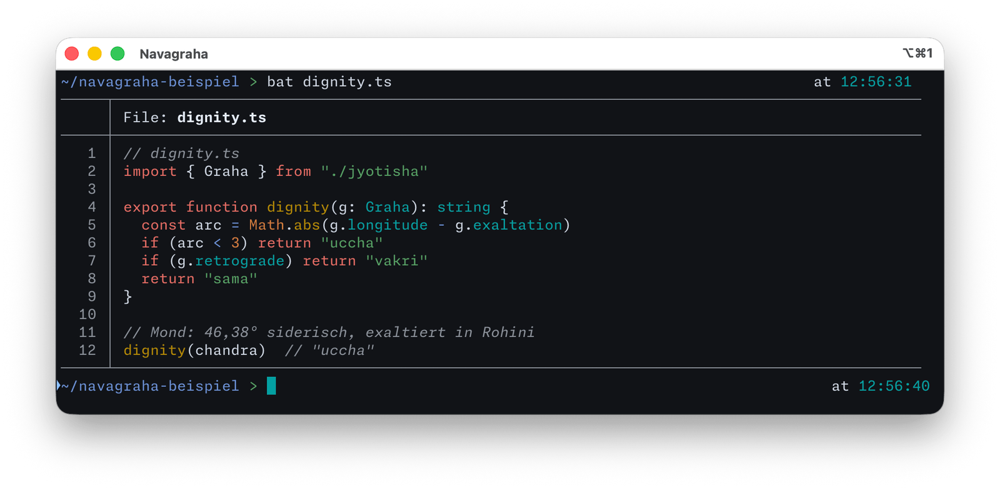
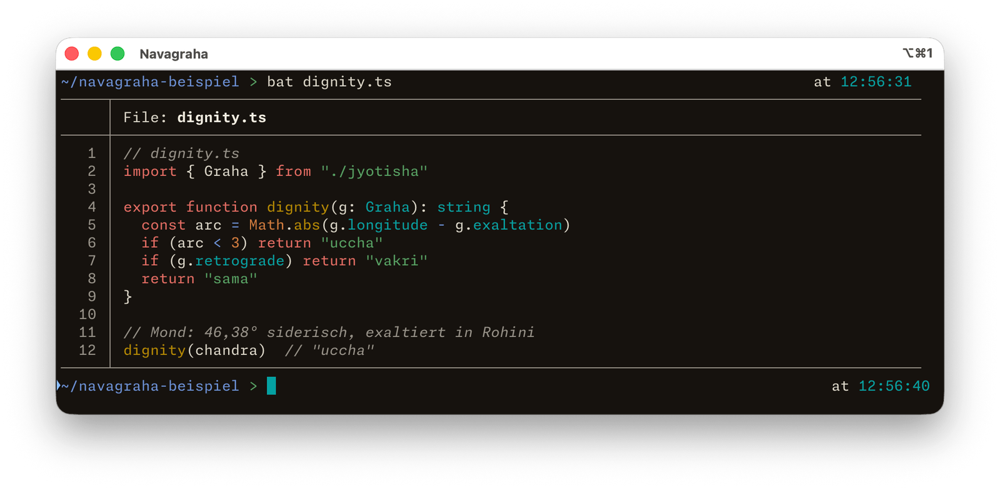
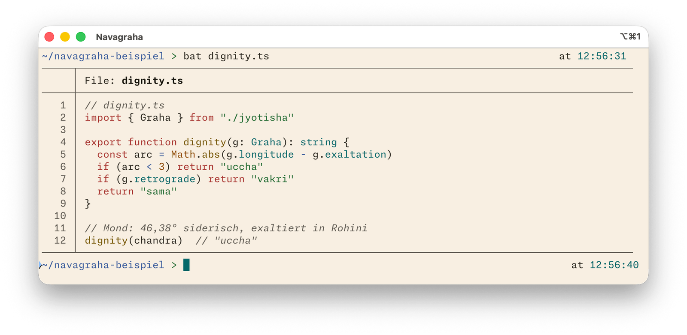
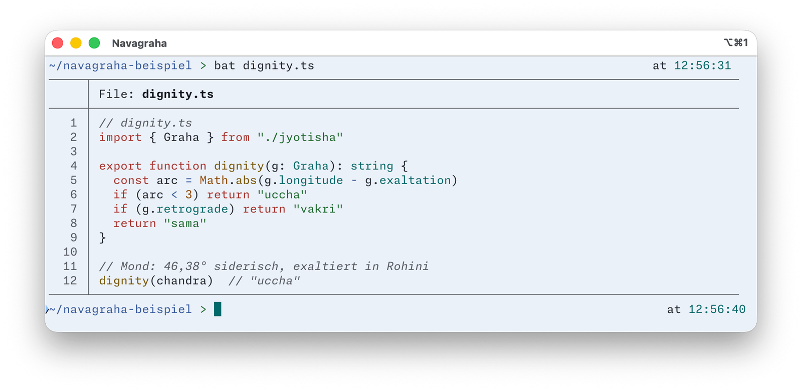

  

<h2 align="center">Navagraha für bat</h2>

Neun Planeten, neun Farben — ein Farbschema, abgelesen aus einem Geburtshoroskop.

  <a href="https://daehnie.github.io/navagraha/">Zur Seite</a> · <a href="#english">English</a>

Das Theme setzt keine eigenen Farben, sondern nimmt die 16 ANSI-Plätze vom
Terminal. Es folgt deshalb der Variante, die dort eingestellt ist — eine
Datei für alle vier. Das Terminal braucht dafür selbst Navagraha, etwa in
[iTerm2](../iterm2/) oder [Tabby](../tabby/).

## Einbauen

1. Das Theme ablegen und bats Cache neu bauen:

       mkdir -p "$(bat --config-dir)/themes"
       cp navagraha.tmTheme "$(bat --config-dir)/themes/"
       bat cache --build

   Ob bat das Theme kennt, zeigt:

       bat --list-themes | grep navagraha

   Steht dort nichts, nimmt bat ohne Warnung sein Standard-Theme. Nach jeder
   Änderung an `navagraha.tmTheme` muss `bat cache --build` erneut laufen.

2. In bats Konfigurationsdatei `$(bat --config-dir)/config` eintragen:

       --theme=navagraha
       --italic-text=always

   Die zweite Zeile braucht es für kursive Kommentare; bat schreibt
   sonst nichts kursiv.

## Galerie

**Navagraha Swati** · dunkel

**Navagraha Pratipada** · dunkel

**Navagraha Ushas** · hell

**Navagraha Tula** · hell

---

## English

Nine planets, nine colours — a colour scheme read from a birth chart.
[Visit the site](https://daehnie.github.io/navagraha/en/).

The theme sets no colours of its own: it reads the 16 ANSI slots from the
terminal and therefore follows whichever Navagraha variant the terminal is
using — one file for all four.

1. Copy `navagraha.tmTheme` to `$(bat --config-dir)/themes/` and run
   `bat cache --build`. Check with `bat --list-themes | grep navagraha` —
   if it isn't listed, bat silently falls back to its default theme. Run
   `bat cache --build` again after any change to the theme file.
2. Add `--theme=navagraha` and `--italic-text=always` to
   `$(bat --config-dir)/config`. The second line enables italic comments;
   bat prints nothing in italics otherwise.
