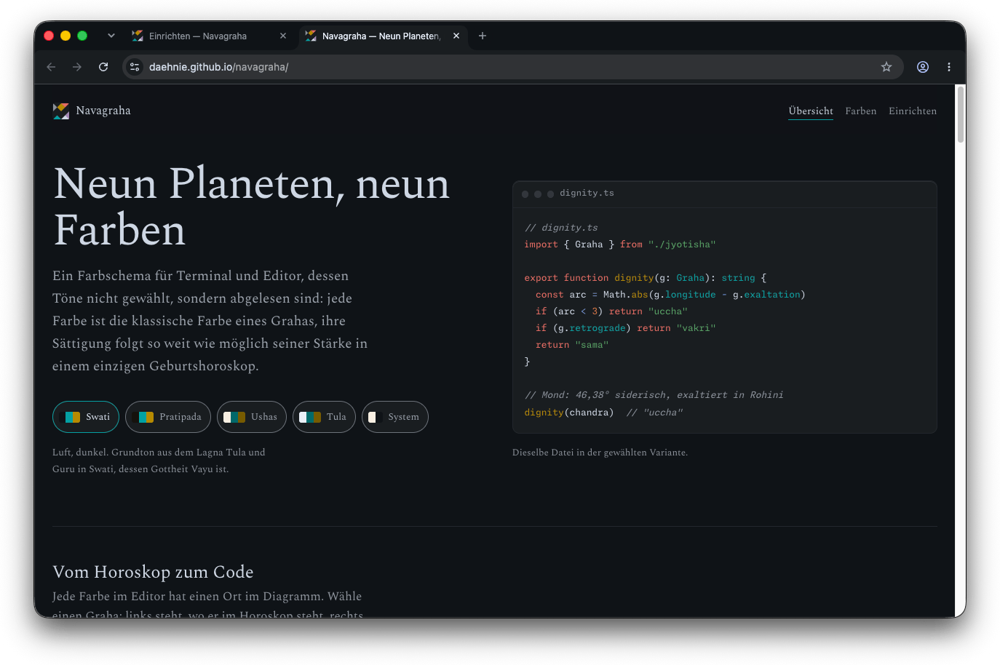
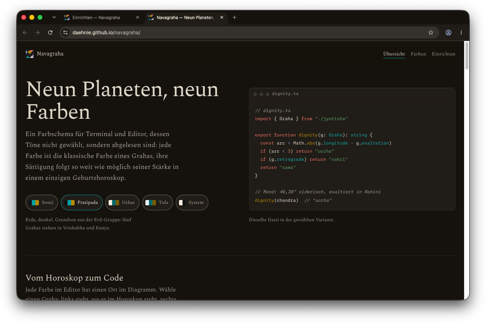
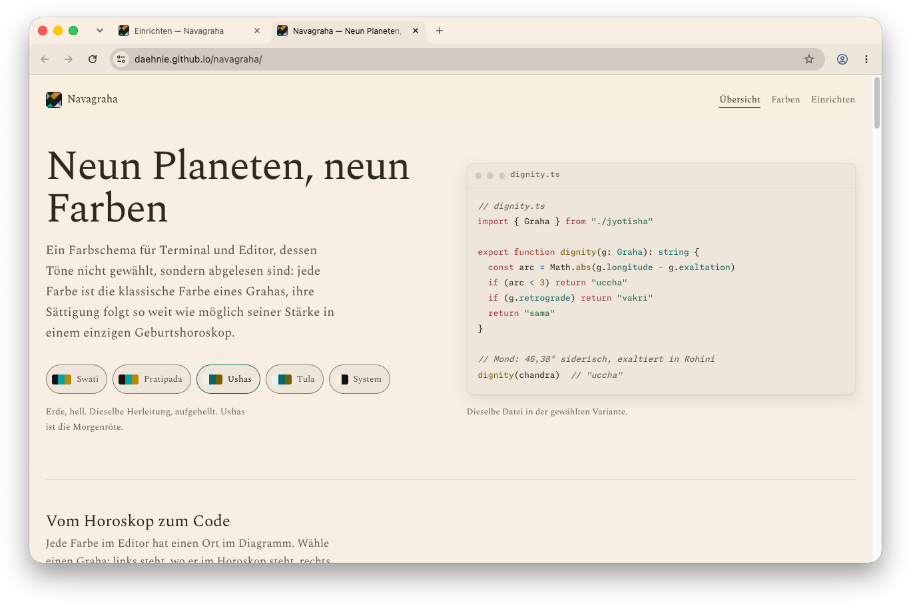
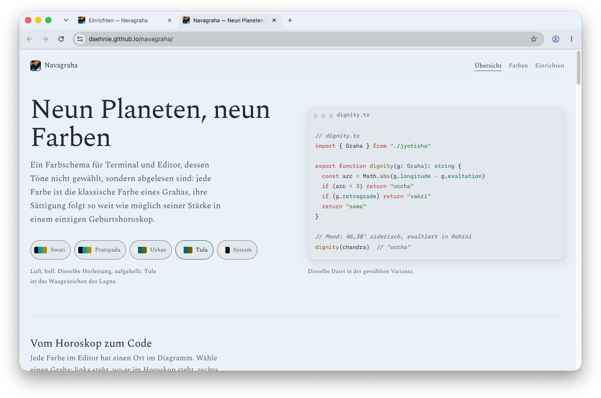

  

<h2 align="center">Navagraha für Chrome</h2>

Neun Planeten, neun Farben — ein Farbschema, abgelesen aus einem Geburtshoroskop.

  <a href="https://daehnie.github.io/navagraha/">Zur Seite</a> · <a href="#english">English</a>

Vier Designs für Chrome, zwei dunkle (Swati, Pratipada) und zwei helle
(Ushas, Tula). Jedes liegt in einem eigenen Ordner, weil eine Erweiterung
genau ein Design tragen kann.

## Einbauen

1. **⋮ → Erweiterungen → Erweiterungen verwalten** öffnen
   (oder `chrome://extensions` eingeben).
2. Oben rechts den **Entwicklermodus** einschalten.
3. **Entpackte Erweiterung laden** klicken und einen der vier Ordner wählen,
   etwa `navagraha-swati`. Das Design gilt sofort.

Zum Wechseln denselben Schritt mit einem anderen Ordner wiederholen — Chrome
trägt immer nur ein Design, das neue ersetzt das alte. Zurück zum
Auslieferungszustand geht es unter **Einstellungen → Darstellung** mit
**Standard wiederherstellen**.

## Gut zu wissen

Chrome folgt der Systemdarstellung nicht mehr, sobald ein Design gesetzt ist:
Die gewählte Variante gilt für hell und dunkel gleichermaßen.

Das Inkognito-Fenster bleibt in Chromes eigenem Dunkelgrau. Das ist Absicht —
eingefärbt sähe es in den hellen Varianten aus wie ein gewöhnliches Fenster,
und woran man den Modus erkennt, sollte das Design nicht verwischen.

Die Ordnung der Flächen ist dieselbe wie im Editor: der Rahmen liegt hinten,
die Werkzeugleiste darauf, das Adressfeld darin. Inaktive Tabs gehören zum
Rahmen, der aktive trägt die Farbe der Werkzeugleiste.

## Galerie

**Navagraha Swati** · dunkel

**Navagraha Pratipada** · dunkel

**Navagraha Ushas** · hell

**Navagraha Tula** · hell

---

## English

Nine planets, nine colours — a colour scheme read from a birth chart.
[Visit the site](https://daehnie.github.io/navagraha/en/).

Four themes, each in its own folder, because one extension carries exactly
one theme.

1. Open **⋮ → Extensions → Manage Extensions** (or type `chrome://extensions`).
2. Turn on **Developer mode** in the top right.
3. Click **Load unpacked** and pick one of the four folders, for example
   `navagraha-swati`. The theme applies at once.

Repeat with another folder to switch — Chrome holds one theme at a time, so
the new one replaces the old. **Settings → Appearance → Reset to default**
puts Chrome back the way it shipped.

Once a theme is set, Chrome no longer follows the system appearance: the
chosen variant applies in both light and dark surroundings.

Incognito windows keep Chrome's own dark grey on purpose. Tinted, they would
look like ordinary windows in the light variants, and a theme should not blur
the one thing that marks the mode.
