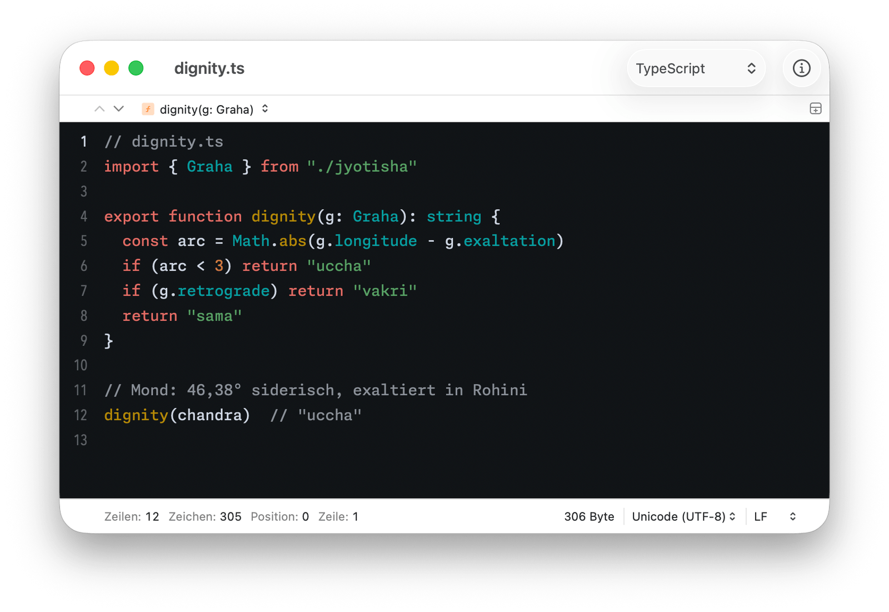
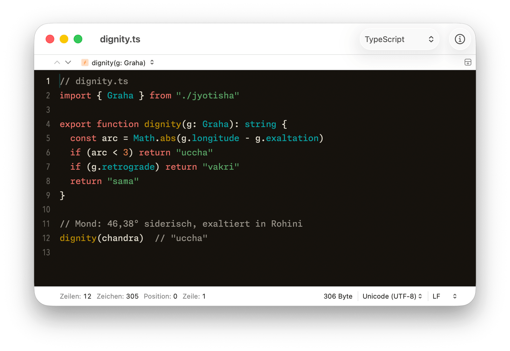
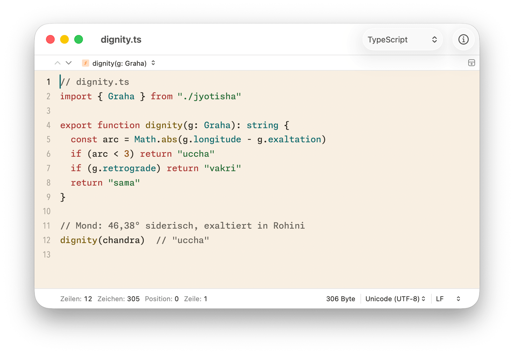
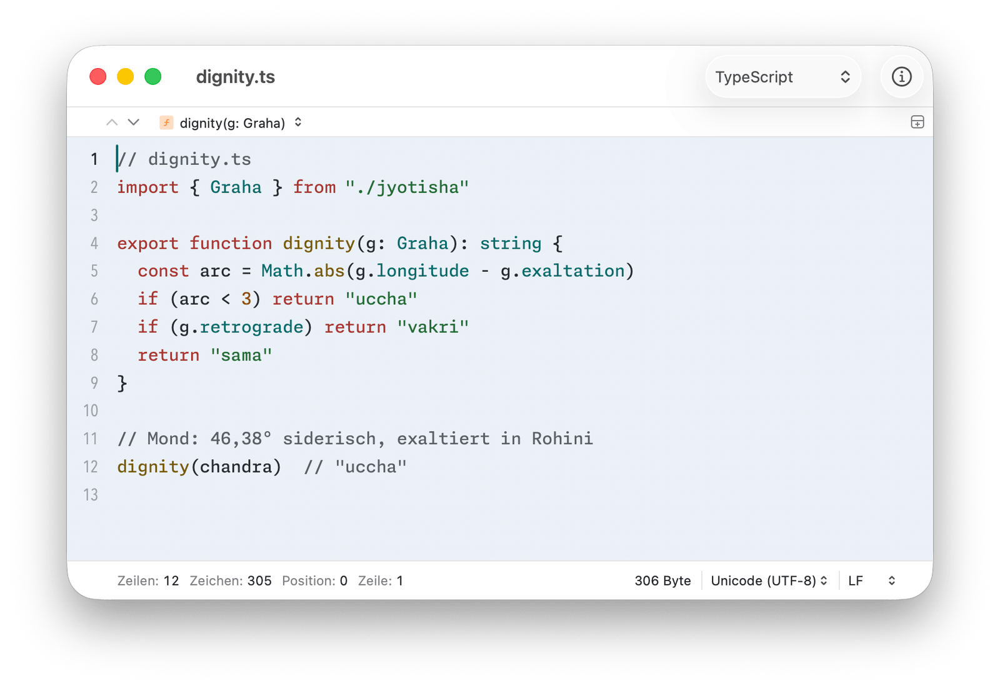

  

<h2 align="center">Navagraha für CotEditor</h2>

Neun Planeten, neun Farben — ein Farbschema, abgelesen aus einem Geburtshoroskop.

  <a href="https://daehnie.github.io/navagraha/">Zur Seite</a> · <a href="#english">English</a>

Vier Themes für CotEditor, zwei dunkle (Swati, Pratipada) und zwei helle
(Ushas, Tula).

## Einbauen

Die `.cottheme`-Dateien unter **Settings → Appearance**
(*Einstellungen → Aussehen*) in die Themeliste ziehen.

Oder in den Theme-Ordner kopieren. Für CotEditor aus dem App Store:

    mkdir -p ~/Library/Containers/com.coteditor.CotEditor/Data/Library/Application\ Support/CotEditor/Themes
    cp *.cottheme ~/Library/Containers/com.coteditor.CotEditor/Data/Library/Application\ Support/CotEditor/Themes/

Für CotEditor von der Website oder über Homebrew:

    mkdir -p ~/Library/Application\ Support/CotEditor/Themes
    cp *.cottheme ~/Library/Application\ Support/CotEditor/Themes/

## Hell und dunkel automatisch

CotEditor wechselt selbst, wenn zwei Themes gleich heißen und auf
„(Dark)“ und „(Light)“ enden. Dafür zwei Kopien umbenennen, etwa:

    Navagraha Swati.cottheme  →  Navagraha (Dark).cottheme
    Navagraha Ushas.cottheme  →  Navagraha (Light).cottheme

CotEditor neu starten, eines der beiden wählen und unter
**Settings → Appearance** bei **Appearance** die Einstellung
**Match System** wählen (*Aussehen → Erscheinungsbild: System anpassen*).

## Gut zu wissen

CotEditor kennt keine eigene Farbe für Operatoren und keine Kursivschrift:
`=` oder `<` stehen im Grundtext, Kommentare gerade.

## Galerie

**Navagraha Swati** · dunkel

**Navagraha Pratipada** · dunkel

**Navagraha Ushas** · hell

**Navagraha Tula** · hell

---

## English

Nine planets, nine colours — a colour scheme read from a birth chart.
[Visit the site](https://daehnie.github.io/navagraha/en/).

Drag the four `.cottheme` files into the theme list under **Settings →
Appearance**, or copy them to
`~/Library/Containers/com.coteditor.CotEditor/Data/Library/Application Support/CotEditor/Themes/`
(Mac App Store) or `~/Library/Application Support/CotEditor/Themes/`
(website download or Homebrew).

To follow the system appearance, rename two copies so they share a base name
ending in "(Dark)" and "(Light)" — for example `Navagraha (Dark).cottheme`
from Swati and `Navagraha (Light).cottheme` from Ushas — restart CotEditor
and set **Appearance** to **Match System**.

CotEditor has no colour category for operators and no italics, so `=` or
`<` stay in the base text colour and comments are upright.
