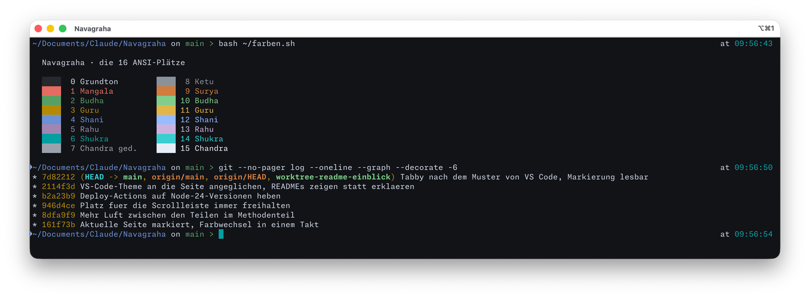
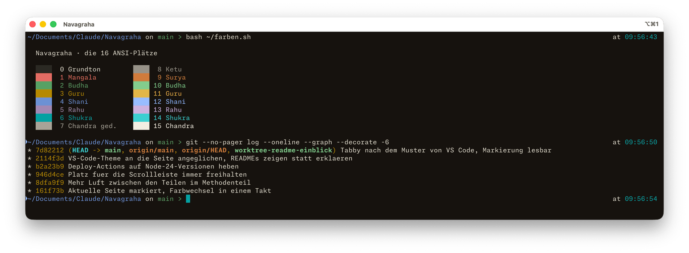
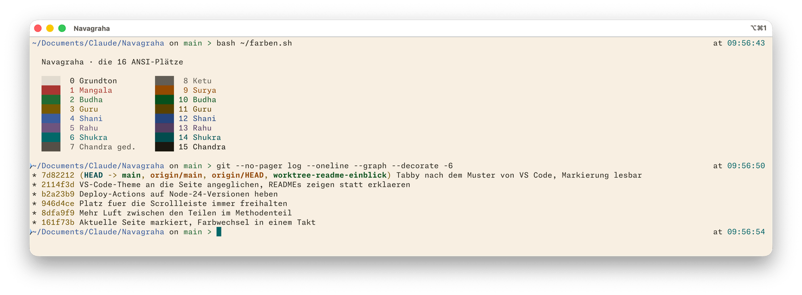
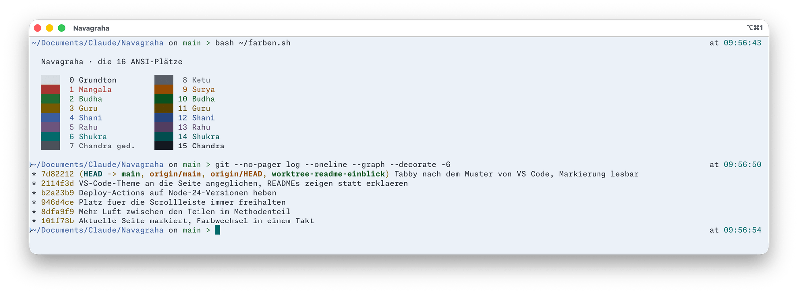

  

<h2 align="center">Navagraha für iTerm2</h2>

Neun Planeten, neun Farben — ein Farbschema, abgelesen aus einem Geburtshoroskop.

  <a href="https://daehnie.github.io/navagraha/">Zur Seite</a> · <a href="#english">English</a>

## Einbauen

1. Die vier `.itermcolors`-Dateien doppelklicken. iTerm2 nimmt sie als
   Voreinstellungen auf und benennt sie nach der Datei.
2. **Settings → Profiles → Colors** öffnen und unter **Color Presets…**
   eine Variante wählen, etwa *Navagraha Swati*.

## Hell und dunkel automatisch

1. Im selben Bereich **Use separate colors for light and dark mode**
   anhaken.
2. Mit dem Schalter **Editing** zwischen den beiden Modi wechseln und für
   jeden unter **Color Presets…** eine Variante wählen — etwa Swati für
   dunkel und Ushas für hell.

## Galerie

**Navagraha Swati** · dunkel

**Navagraha Pratipada** · dunkel

**Navagraha Ushas** · hell

**Navagraha Tula** · hell

---

## English

Nine planets, nine colours — a colour scheme read from a birth chart.
[Visit the site](https://daehnie.github.io/navagraha/en/).

1. Double-click the four `.itermcolors` files to add them as presets.
2. Open **Settings → Profiles → Colors** and pick a variant under
   **Color Presets…**.

To follow the system appearance, tick **Use separate colors for light and
dark mode**, switch between the modes with the **Editing** control and pick
a preset for each — for example Swati for dark and Ushas for light.
