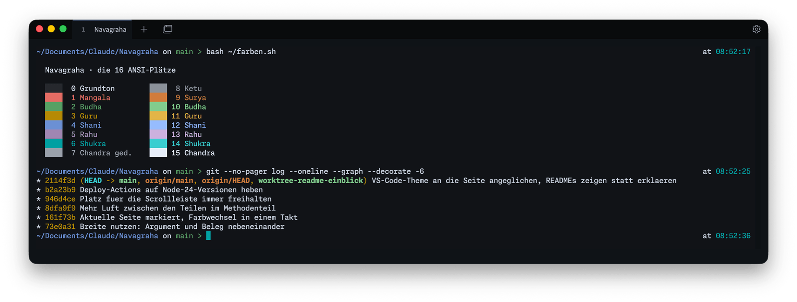
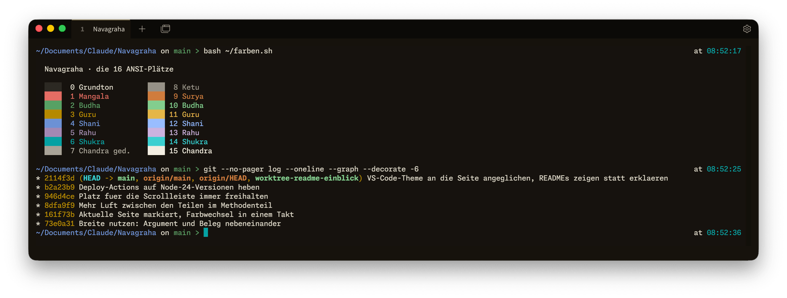
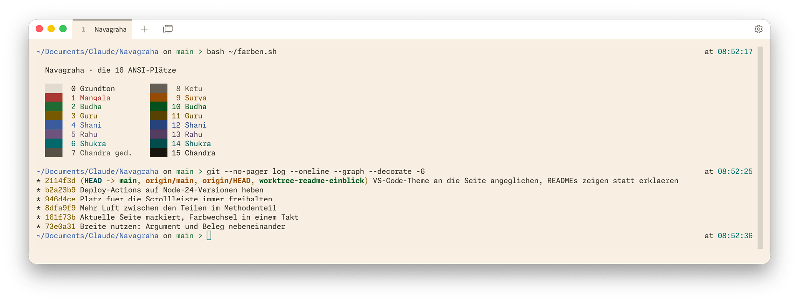
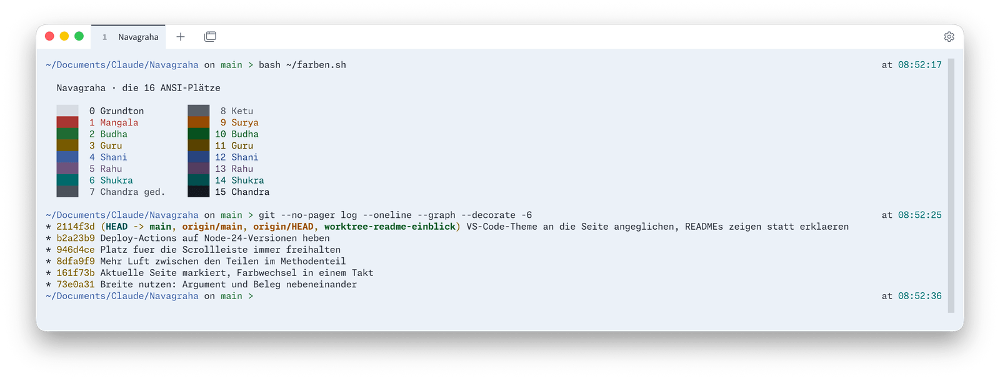

  

<h2 align="center">Navagraha für Tabby</h2>

Neun Planeten, neun Farben — ein Farbschema, abgelesen aus einem Geburtshoroskop.

  <a href="https://daehnie.github.io/navagraha/">Zur Seite</a> · <a href="#english">English</a>

## Einbauen

1. In Tabby **Settings → Config file** öffnen
   (deutsch: *Einstellungen → Konfigurationsdatei*).
2. Aus [`navagraha.yaml`](navagraha.yaml) die vier Einträge ab `- name:`
   unter `terminal:` → `customColorSchemes:` einfügen. Gibt es
   `customColorSchemes:` dort noch nicht, beide Zeilen mit übernehmen.
3. Unter **Settings → Color scheme** (*Farbschema*) im Reiter **Dark mode**
   (*Dunkler Modus*) eine dunkle Variante wählen, im Reiter **Light mode**
   (*Heller Modus*) eine helle.
4. Bei **Switch color scheme** (*Farbschema wechseln*) **From system**
   (*Vom System*) wählen — dann wechselt Tabby mit dem System zwischen beiden.

Zieht der Hintergrund nicht mit: **Settings → Appearance → Terminal
background → From color scheme** (*Darstellung → Terminal-Hintergrund → Aus
dem Farbschema*).

## Galerie

**Navagraha Swati** · dunkel

**Navagraha Pratipada** · dunkel

**Navagraha Ushas** · hell

**Navagraha Tula** · hell

---

## English

Nine planets, nine colours — a colour scheme read from a birth chart.
[Visit the site](https://daehnie.github.io/navagraha/en/).

1. Open **Settings → Config file**.
2. Paste the four entries starting at `- name:` from
   [`navagraha.yaml`](navagraha.yaml) under `terminal:` →
   `customColorSchemes:`. If `customColorSchemes:` doesn't exist yet, add
   both lines too.
3. Under **Settings → Color scheme**, pick a dark variant in the **Dark
   mode** tab and a light one in **Light mode**.
4. Set **Switch color scheme** to **From system** to follow the system
   appearance.

If the background doesn't follow: **Settings → Appearance → Terminal
background → From color scheme**.
