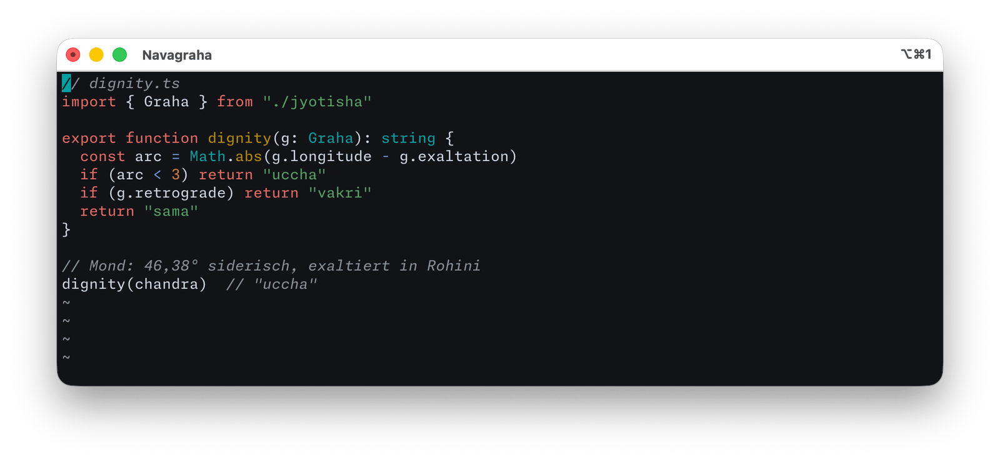
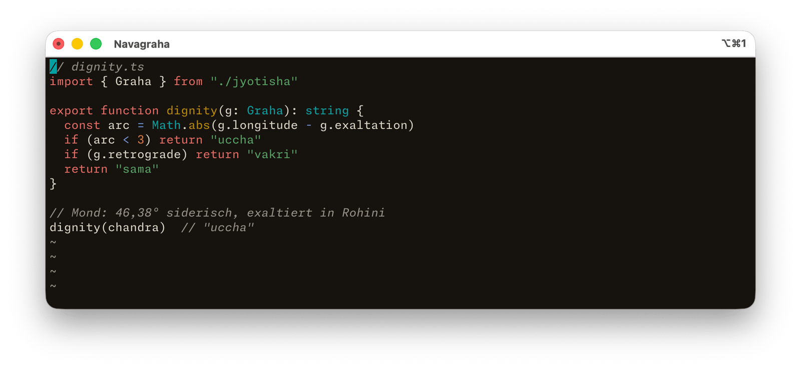
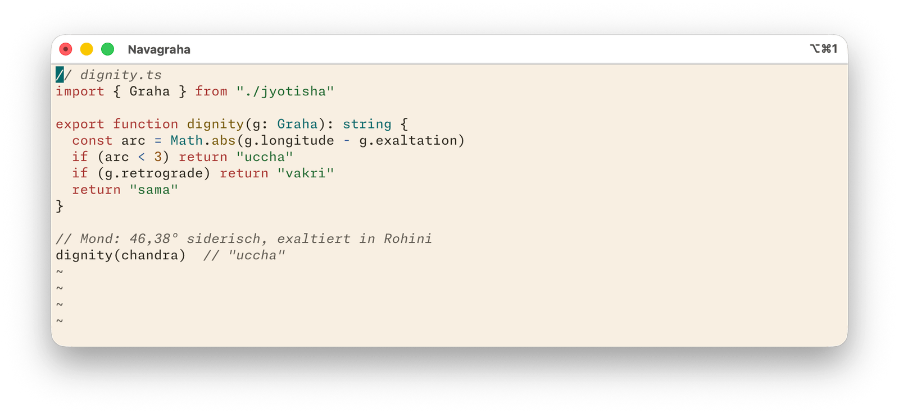
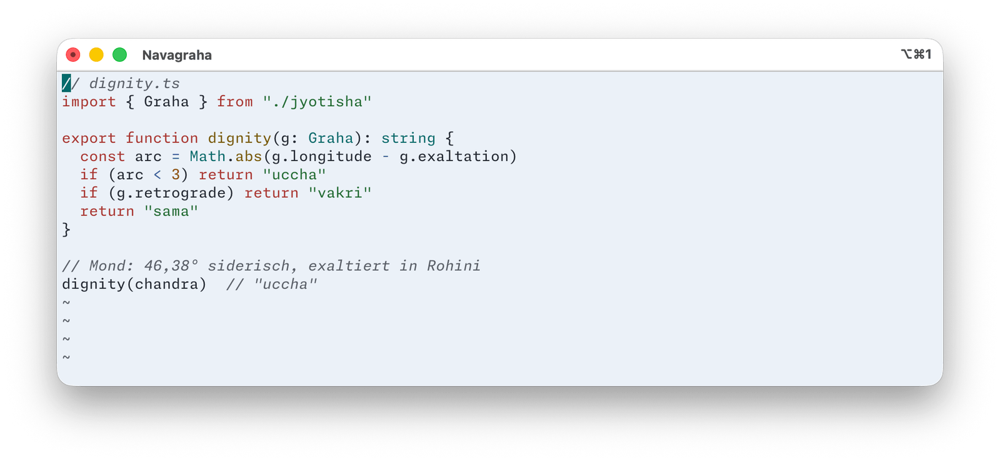

  

<h2 align="center">Navagraha für Vim</h2>

Neun Planeten, neun Farben — ein Farbschema, abgelesen aus einem Geburtshoroskop.

  <a href="https://daehnie.github.io/navagraha/">Zur Seite</a> · <a href="#english">English</a>

Das Schema setzt keine eigenen Farben, sondern nimmt die 16 ANSI-Plätze vom
Terminal. Es folgt deshalb der Variante, die dort eingestellt ist — eine
Datei für alle vier. Das Terminal braucht dafür selbst Navagraha, etwa in
[iTerm2](../iterm2/) oder [Tabby](../tabby/).

## Einbauen

1. Die Datei ablegen:

       mkdir -p ~/.vim/colors
       cp navagraha.vim ~/.vim/colors/

   Für Neovim gehört sie nach `~/.config/nvim/colors/`.
2. In der `~/.vimrc`:

       syntax on
       colorscheme navagraha

`termguicolors` muss aus bleiben, sonst übergeht Vim die Terminalfarben.
Neovim schaltet es ab Version 0.10 selbst ein; dort vor `colorscheme` noch
`set notermguicolors` eintragen.

## Gut zu wissen

Das Vim von macOS startet mit der alten Regex-Engine (`regexpengine=1`),
obwohl Vim selbst die automatische Wahl vorsieht. Bei TypeScript dauert die
Syntaxprüfung damit so lange, dass Vim die Hervorhebung mit *'redrawtime'
exceeded* abschaltet. Abhilfe in der `~/.vimrc`:

    set regexpengine=0

Der ANSI-Platz für „helles Rot“ trägt in Navagraha Kupfer. Programme, die
Fehler damit färben, zeigen sie deshalb in Kupferorange. Vim selbst zeigt
Fehler weiter in Rot.

## Galerie

**Navagraha Swati** · dunkel

**Navagraha Pratipada** · dunkel

**Navagraha Ushas** · hell

**Navagraha Tula** · hell

---

## English

Nine planets, nine colours — a colour scheme read from a birth chart.
[Visit the site](https://daehnie.github.io/navagraha/en/).

The scheme sets no colours of its own: it reads the 16 ANSI slots from the
terminal and therefore follows whichever Navagraha variant the terminal is
using — one file for all four.

1. Copy `navagraha.vim` to `~/.vim/colors/` (or `~/.config/nvim/colors/`
   for Neovim).
2. Add `syntax on` and `colorscheme navagraha` to your config.

Keep `termguicolors` off, or Vim ignores the terminal colours. Neovim 0.10
and later turns it on by itself, so add `set notermguicolors` before
`colorscheme`. The Vim that ships with macOS starts with the old regex engine
(`regexpengine=1`); with TypeScript, highlighting then takes long enough that
Vim switches it off ('redrawtime' exceeded) — add `set regexpengine=0` to your
`~/.vimrc`. The "bright red" ANSI slot carries copper in Navagraha, so
programs that use it for errors show them in copper orange; Vim itself keeps
errors red.
