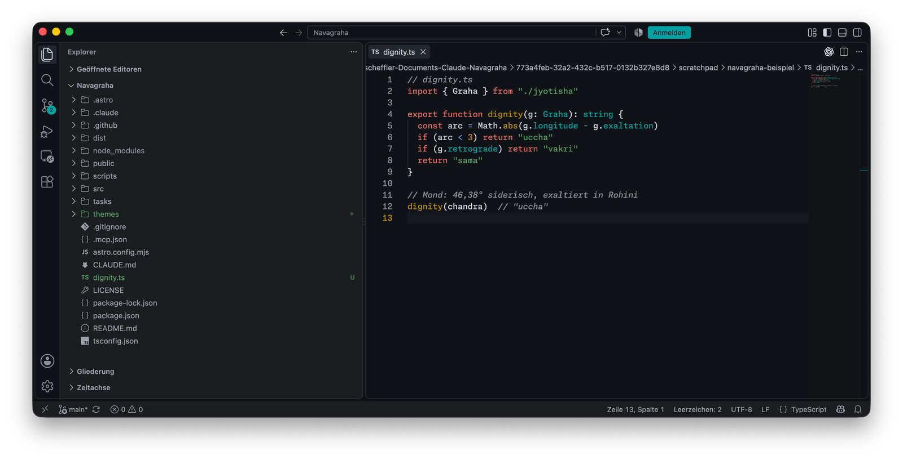
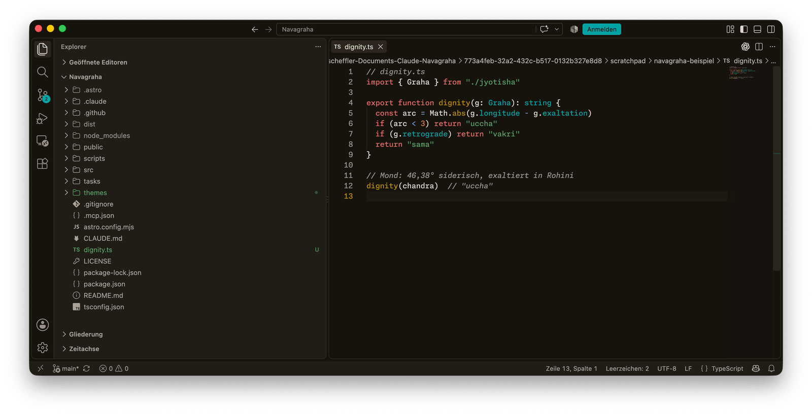
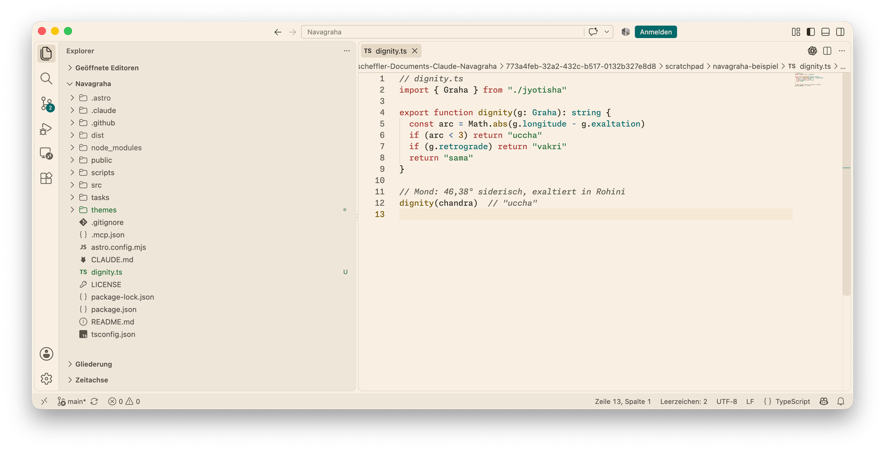
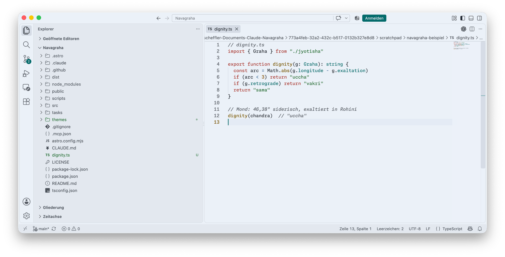

  

<h2 align="center">Navagraha für VS Code</h2>

Neun Planeten, neun Farben — ein Farbschema, abgelesen aus einem Geburtshoroskop.

  <a href="https://daehnie.github.io/navagraha/">Zur Seite</a> · <a href="#english">English</a>

## Einbauen

1. Diesen Ordner nach `~/.vscode/extensions/` kopieren:

       cp -R navagraha ~/.vscode/extensions/

2. VS Code neu starten.
3. Mit ⌘K ⌘T (Windows und Linux: Strg+K Strg+T) eine Variante wählen.

## Galerie

> Schrift: [Monaspace Neon](https://monaspace.githubnext.com)

**Navagraha Swati** · dunkel

**Navagraha Pratipada** · dunkel

**Navagraha Ushas** · hell

**Navagraha Tula** · hell

---

## English

Nine planets, nine colours — a colour scheme read from a birth chart.
[Visit the site](https://daehnie.github.io/navagraha/en/).

1. Copy this folder to `~/.vscode/extensions/`:

       cp -R navagraha ~/.vscode/extensions/

2. Restart VS Code.
3. Pick a variant with ⌘K ⌘T (Ctrl+K Ctrl+T on Windows and Linux).

The gallery above shows all four variants.
